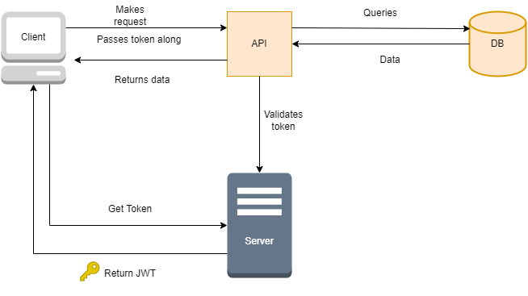

# CoffeeShopper

##Project structure

- DataAccess: Class Library that holds the application database
- API: Project that exposes the data from the database
- Server: Holds the IdentityServer4 Views, Controllers, entity definitions and migrations
- Client: A simple Blazor Server project

